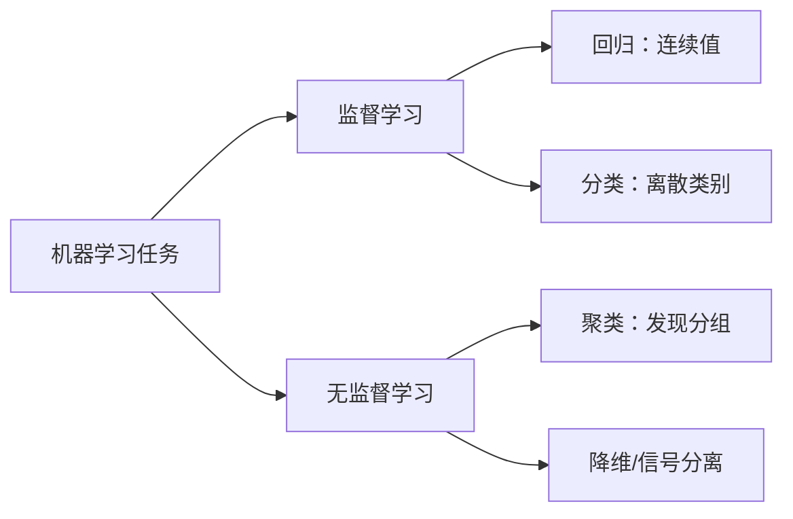
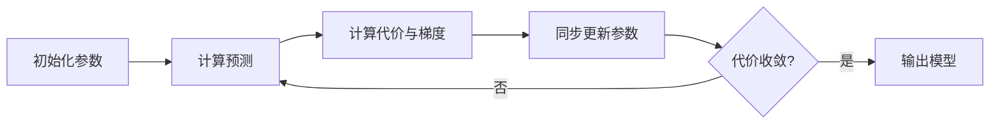
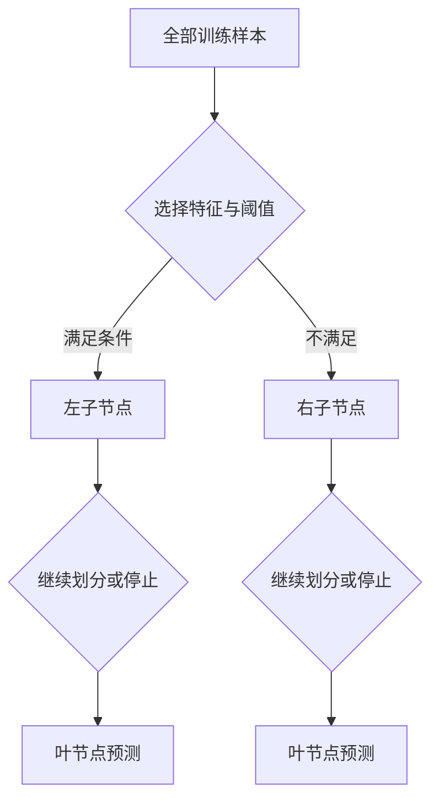
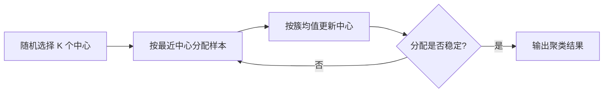
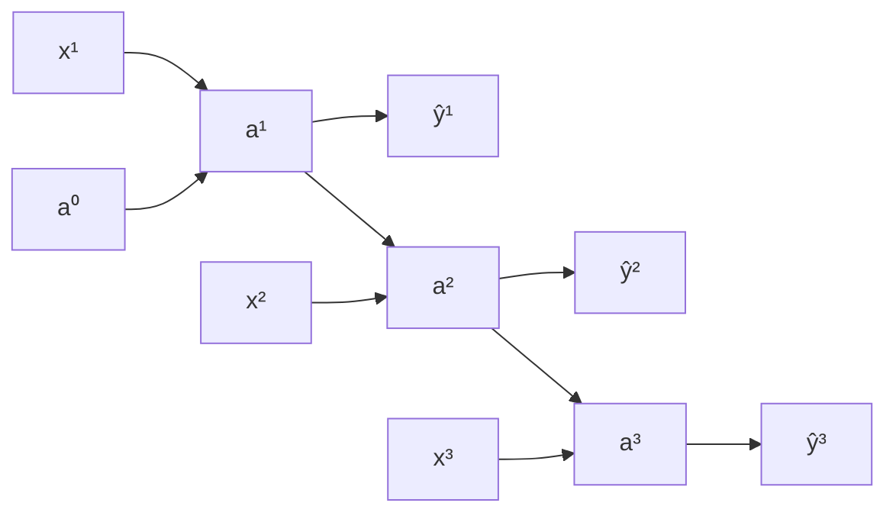

# 机器学习与深度学习课程笔记

> 博客版：[机器学习与深度学习课程笔记](https://wangyujie.space/ML-DL-Course-Notes/)

这篇文章把两份课程笔记整理为一条从经典机器学习到深度学习与计算机视觉的复习路线。原稿中的截图和手写内容已尽量转写为文字、LaTeX、表格与 Mermaid 流程图。

> 文中的 `p.` 页码对应两份原始 PDF，便于回查手写推导；正文可以独立阅读，不依赖原 PDF 或图片资源。

# 学习路线与导航

| 阶段 | 内容 | 重点 |
| --- | --- | --- |
| 1 | [机器学习基础](#ml-notes) | 回归、分类、正则化、模型诊断 |
| 2 | [经典机器学习算法](#ml-notes) | SVM、树与集成学习、聚类、PCA、推荐系统 |
| 3 | [可信实验与评估](#ml-workflow) | 防止泄漏、Pipeline、指标、校准、复现 |
| 4 | [神经网络基础](#dl-notes) | 向量化、前向/反向传播、初始化 |
| 5 | [深层网络训练](#dl-notes) | 正则化、优化器、BatchNorm、项目策略 |
| 6 | [计算机视觉](#dl-notes) | CNN、ResNet、Inception、目标检测、人脸与风格迁移 |
| 7 | [序列模型](#sequence-models) | RNN、GRU/LSTM、词向量、Seq2Seq、Attention |

配套阅读：[深度学习概念笔记](https://wangyujie.space/DL/)、[PyTorch](https://wangyujie.space/Pytorch/)、[训练经验](https://wangyujie.space/DLtrain/)、[部署与量化](https://wangyujie.space/DLdeploy/)。本文侧重 Andrew Ng 课程体系和公式复习，配套文章侧重专题原理、API 与工程实践。


<span id="ml-notes"></span>

# 第一部分：机器学习

## 记号约定

| 记号 | 含义 |
|---|---|
| $m$ | 训练样本数 |
| $n$ | 特征数 |
| $x^{(i)}$ | 第 $i$ 个样本，通常令 $x_0^{(i)}=1$ |
| $y^{(i)}$ | 第 $i$ 个标签 |
| $\theta$ | 模型参数 |
| $h_\theta(x)$ | 假设函数/预测函数 |
| $J(\theta)$ | 代价函数 |
| $\alpha$ | 学习率 |
| $\lambda$ | 正则化强度 |

---

## 1. 引言（p.3–4）

Tom Mitchell 的定义：若程序在任务 $T$ 上的表现（用指标 $P$ 衡量）随经验 $E$ 增加而提高，则称程序从经验中学习。

### 1.1 监督学习

训练数据包含输入 $x$ 和标签 $y$。

- **回归**：预测连续值，如房价。
- **分类**：预测离散类别，如肿瘤良性/恶性。

### 1.2 无监督学习

训练数据没有标签，算法寻找潜在结构。

- **聚类**：把相似样本分组，如新闻主题聚合。
- **信号分离**：从混合信号中恢复独立源（原稿称“鸡尾酒会问题”）。



---

## 2. 单变量线性回归（p.5–10）

### 2.1 模型与代价函数


单特征线性模型：

$$
h_\theta(x)=\theta_0+\theta_1x
$$

平方误差代价：

$$
J(\theta_0,\theta_1)=\frac{1}{2m}\sum_{i=1}^{m}\left(h_\theta(x^{(i)})-y^{(i)}\right)^2
$$

系数 $1/2$ 使求导后的常数消掉，不影响最优解。等高线图上越靠近中心，$J$ 越小。

### 2.2 梯度下降

同步更新所有参数：

$$
\theta_j \leftarrow \theta_j-\alpha\frac{\partial J(\theta)}{\partial\theta_j},\quad j=0,1
$$

在线性回归中：

$$
\frac{\partial J}{\partial\theta_j}=\frac{1}{m}\sum_{i=1}^{m}
\left(h_\theta(x^{(i)})-y^{(i)}\right)x_j^{(i)}
$$

“批量”梯度下降指每次参数更新都使用全部 $m$ 个样本。线性回归的平方误差是凸函数，因此不存在需要逃离的局部极小值。



**检查要点**：

1. 更新必须基于同一轮旧参数，不能先更新 $\theta_0$ 再用新值计算 $\theta_1$。
2. $\alpha$ 太小收敛慢，太大可能震荡或发散。
3. 迭代时观察 $J(\theta)$ 是否持续下降。

---

## 3. 线性代数回顾（p.11）

- 向量可看作 $n\times1$ 矩阵；矩阵 $A\in\mathbb R^{m\times n}$。
- 只有相同形状的矩阵才能逐元素加减。
- 若 $A\in\mathbb R^{m\times n}$、$B\in\mathbb R^{n\times p}$，则 $AB\in\mathbb R^{m\times p}$。
- 矩阵乘法一般不满足交换律：$AB\ne BA$；满足结合律：$(AB)C=A(BC)$。
- $(AB)^T=B^TA^T$。
- 方阵 $A$ 可逆时 $A^{-1}A=I$；奇异矩阵没有逆。实践中优先使用线性方程求解器，不显式计算逆矩阵。

---

## 4. 多变量线性回归（p.12–16）

### 4.1 向量化模型

$$
h_\theta(x)=\theta^Tx
$$

矩阵形式：$X\in\mathbb R^{m\times(n+1)}$，预测为 $X\theta$。

### 4.2 特征缩放与学习率

不同特征尺度相差很大时，代价函数等高线狭长，梯度下降会来回摆动。常用标准化：

$$
x_j\leftarrow\frac{x_j-\mu_j}{s_j}
$$

$s_j$ 可取标准差或范围。原稿建议按数量级尝试学习率，如 $0.01,0.03,0.1,0.3,1$，并用学习曲线判断。

### 4.3 多项式特征

通过 $x,x^2,x^3$ 或交叉项构造非线性边界。新增高次项后尤其需要特征缩放，也要警惕过拟合。

### 4.4 正规方程

$$
\theta=(X^TX)^{-1}X^Ty
$$

它不需要选择学习率，但计算和存储成本随特征数快速增加。$X^TX$ 不可逆通常来自冗余特征或特征数大于样本数；可删除线性相关特征，或使用伪逆/正则化求解。

---

## 6. 逻辑回归（p.17–21）

> 原 PDF 目录从第 4 章直接跳到第 6 章，本版保留原编号。

### 6.1 假设函数与概率解释

$$
h_\theta(x)=\sigma(\theta^Tx),\qquad
\sigma(z)=\frac{1}{1+e^{-z}}
$$

$h_\theta(x)$ 可解释为 $P(y=1\mid x;\theta)$。阈值为 0.5 时，$\theta^Tx\ge0$ 判为正类，$\theta^Tx=0$ 是决策边界。

### 6.2 交叉熵代价

单样本损失：

$$
\operatorname{Cost}(h,y)=-y\log h-(1-y)\log(1-h)
$$

总体代价：

$$
J(\theta)=-\frac1m\sum_{i=1}^m\left[y^{(i)}\log h_\theta(x^{(i)})+(1-y^{(i)})\log(1-h_\theta(x^{(i)}))\right]
$$

梯度形式与线性回归相似，但 $h_\theta$ 已换成 sigmoid。该目标是凸函数。

### 6.3 高级优化与多分类


共轭梯度、BFGS、L-BFGS 等算法通常比手写梯度下降更快，也更少需要人工选学习率。多分类可用 **one-vs-rest**：每个类别训练一个二分类器，预测时选概率最高的类别。

---

## 7. 正则化（p.22–24）

过拟合表现为训练误差很低、对新数据泛化差。L2 正则化线性回归：

$$
J(\theta)=\frac{1}{2m}\sum_i(h_\theta(x^{(i)})-y^{(i)})^2+
\frac{\lambda}{2m}\sum_{j=1}^{n}\theta_j^2
$$

通常不惩罚偏置 $\theta_0$。对 $j\ge1$ 的更新可写为：

$$
\theta_j\leftarrow\theta_j\left(1-\alpha\frac{\lambda}{m}\right)
-\alpha\frac1m\sum_i(h_\theta(x^{(i)})-y^{(i)})x_j^{(i)}
$$

- $\lambda$ 太小：高方差、易过拟合。
- $\lambda$ 太大：参数被压得过小，高偏差、欠拟合。
- 用验证集选择 $\lambda$，不要用测试集调参。

逻辑回归同样在交叉熵后加入参数平方和。

---

## 8. 神经网络：表示（p.26–30）

当输入维度高、需要复杂非线性特征组合时，显式构造所有多项式项会迅速膨胀。神经网络让隐藏层自行学习中间表示。

第 $l$ 层：

$$
z^{[l]}=\Theta^{[l-1]}a^{[l-1]},\qquad a^{[l]}=g(z^{[l]})
$$

其中 $a^{[1]}=x$；偏置可并入激活向量。由输入层向输出层计算称为前向传播。

### 逻辑门直观理解


通过不同权重和偏置，单元可以模拟 AND、OR、NOT；组合隐藏单元可表示 XOR。这说明多层网络能逐层组合简单特征，形成复杂决策边界。

多分类输出通常采用 one-hot 标签和 softmax，使输出维度等于类别数。

---

## 9. 神经网络的学习（p.31–39）

### 9.1 代价函数

多分类交叉熵配合 L2 正则化：

$$
J(\Theta)=-\frac1m\sum_{i=1}^m\sum_{k=1}^K
\left[y_k^{(i)}\log h_k^{(i)}+(1-y_k^{(i)})\log(1-h_k^{(i)})\right]
+\frac{\lambda}{2m}\sum_l\sum_{r,c}(\Theta_{r,c}^{[l]})^2
$$

偏置列通常不正则化。

### 9.2 反向传播

1. 前向传播并缓存 $z^{[l]},a^{[l]}$。
2. 输出层误差：$\delta^{[L]}=a^{[L]}-y$。
3. 向前一层传播：

$$
\delta^{[l]}=(\Theta^{[l]})^T\delta^{[l+1]}\odot g'(z^{[l]})
$$

4. 累积梯度并除以 $m$；非偏置参数加入正则化项。

反向传播本质是链式法则的动态规划：复用中间结果，避免重复求导。

### 9.3 梯度检验

数值近似：

$$
\frac{\partial J}{\partial\theta_j}\approx
\frac{J(\theta+\varepsilon e_j)-J(\theta-\varepsilon e_j)}{2\varepsilon}
$$

比较数值梯度与反向传播梯度的相对误差。梯度检验计算昂贵，只在调试时使用，通过后关闭。

### 9.4 随机初始化

所有权重初始化为 0 会导致同层神经元对称、学到相同特征。应使用小随机数或 Xavier/He 初始化；偏置可初始化为 0。

---

## 10. 应用机器学习的建议（p.40–47）

### 10.1 数据集划分

- 训练集：拟合参数。
- 验证集：选择模型、特征、阈值和超参数。
- 测试集：最后一次给出无偏泛化估计。

### 10.2 偏差与方差


| 现象 | 训练误差 | 验证误差 | 常见对策 |
|---|---:|---:|---|
| 高偏差/欠拟合 | 高 | 高且接近训练误差 | 增加特征或模型容量、减小 $\lambda$ |
| 高方差/过拟合 | 低 | 明显更高 | 增加数据、减少特征/容量、增大 $\lambda$ |

### 10.3 学习曲线

绘制误差随训练样本数增长的曲线：

- 高偏差时两条曲线在较高误差处接近，继续加数据帮助有限。
- 高方差时两条曲线存在间隙，增加数据往往有效。

### 10.4 决策顺序

先用诊断确定问题，再行动。不要默认“多收集数据”一定有效。

1. 高方差：更多样本、减小模型、增大正则化。
2. 高偏差：更多/更好的特征、增大模型、减小正则化。
3. 同时检查数据泄漏、标签质量和训练/验证分布是否一致。

---

## 11. 机器学习系统设计（p.48–52）

### 11.1 误差分析

建立快速基线后，人工检查一批错误样本并分类计数。优先修复覆盖错误最多、成本合理的类别。对于垃圾邮件示例，可比较正文特征、路由特征、词干化和拼写变体，而不是凭直觉投入数周开发。

### 11.2 类别不平衡


准确率在偏斜数据上可能误导。定义：

$$
\text{Precision}=\frac{TP}{TP+FP},\qquad
\text{Recall}=\frac{TP}{TP+FN}
$$

$$
F_1=2\frac{\text{Precision}\cdot\text{Recall}}
{\text{Precision}+\text{Recall}}
$$

调高分类阈值通常提高 Precision、降低 Recall；调低阈值反之。阈值应在验证集上按业务代价选择。目标检测中 AP 衡量单类性能，mAP 是多个类别 AP 的平均。

### 11.3 数据规模

大量数据能带来优势需要两个条件：输入包含足够信息，模型容量足够大。还要保证数据覆盖部署分布，而不是仅追求数量。

---

## 12. 支持向量机（p.53–59）


SVM 直接学习分类边界，核心是最大化分类间隔。软间隔目标可写成：

$$
\min_{w,b,\xi}\ \frac12\lVert w\rVert^2+C\sum_i\xi_i
$$

其中 $C$ 控制违反间隔的惩罚：

- $C$ 大：更重视训练误差，可能高方差。
- $C$ 小：允许更多误分，边界更平滑，可能高偏差。

高斯核（RBF）：

$$
K(x,l)=\exp\left(-\frac{\lVert x-l\rVert^2}{2\sigma^2}\right)
$$

$\sigma$ 小会形成更曲折的局部边界；$\sigma$ 大会形成更平滑的边界。使用成熟库时仍需做特征缩放，并通过验证集选择 $C$ 与核参数。

---

## 补充专题：树模型与集成学习

线性模型依赖特征的加权组合，SVM 依赖间隔与核函数；树模型则不断提出“某个特征是否小于阈值”这类问题，将特征空间递归切分。它通常不要求标准化，能自然表达非线性关系和特征交互，因此常作为表格数据的强基线。

### 决策树与 CART

分类树选择能够最大幅度降低节点不纯度的特征和阈值。常见分类指标为：

$$
H(S)=-\sum_{k=1}^{K}p_k\log p_k,
\qquad
G(S)=1-\sum_{k=1}^{K}p_k^2
$$

其中 $H$ 是信息熵，$G$ 是基尼不纯度。一次划分的收益可写成：

$$
\Delta I=I(S)-\frac{|S_L|}{|S|}I(S_L)-\frac{|S_R|}{|S|}I(S_R)
$$

回归树通常选择使子节点均方误差最小的划分。叶节点输出所属样本的均值；分类树输出多数类或类别概率。



树可以一直生长到完全拟合训练集，因此需要通过 `max_depth`、`min_samples_leaf`、`max_leaf_nodes` 或代价复杂度剪枝限制容量。单棵树直观、可解释，但对数据扰动敏感，方差较大。

### Bagging 与随机森林

Bagging 对训练集进行有放回抽样，独立训练多个高方差模型，然后平均预测：

$$
\hat f(x)=\frac1B\sum_{b=1}^{B}\hat f_b(x)
$$

随机森林在 Bagging 基础上，每次划分只考察随机抽取的一部分特征，以降低树之间的相关性。分类取多数投票，回归取均值。它通常具有以下特点：

- 对缩放不敏感，能处理非线性和特征交互；
- 增加树的数量主要降低方差，但会增加计算量；
- 树深、叶节点样本数和每次候选特征数仍需验证；
- 内置特征重要性可能偏向取值多的特征，解释时优先结合置换重要性或 SHAP。

### Boosting 与梯度提升树

Boosting 按顺序训练弱学习器，让后一个模型修正当前模型的错误。梯度提升把新树拟合到损失函数相对于当前预测的负梯度：

$$
F_t(x)=F_{t-1}(x)+\eta h_t(x)
$$

$\eta$ 是学习率，$h_t$ 是第 $t$ 棵弱树。较小学习率通常需要更多树。常见实现包括 GBDT、XGBoost、LightGBM 和 CatBoost，它们在正则化、采样、类别特征处理和系统优化上各有差异。

| 方法 | 主要作用 | 优点 | 主要风险 |
|---|---|---|---|
| 单棵决策树 | 递归划分空间 | 可解释、无需缩放 | 容易过拟合、结果不稳定 |
| 随机森林 | 并行平均多棵去相关树 | 稳健、参数相对好调 | 模型较大、外推能力弱 |
| 梯度提升树 | 顺序修正残差 | 表格数据上常有很强精度 | 参数较多，需防止过拟合 |
| 线性/逻辑回归 | 学习全局线性关系 | 快、可解释、可外推 | 难以自动表达复杂交互 |
| 神经网络 | 端到端学习表征 | 适合高维非结构化数据 | 更依赖数据量与训练配置 |

实践中应先建立简单基线，再用交叉验证比较。数据量、缺失模式、类别特征、推理延迟和可解释性往往比“哪个模型更先进”更能决定最终选择。

---

## 13. 聚类（p.61–64）

### K-means

重复两步直至收敛：

1. **分配**：$c^{(i)}=\arg\min_k\lVert x^{(i)}-\mu_k\rVert^2$。
2. **更新**：$\mu_k$ 取属于第 $k$ 簇样本的均值。



目标函数：

$$
J(c,\mu)=\frac1m\sum_i\lVert x^{(i)}-\mu_{c^{(i)}}\rVert^2
$$

K-means 对初始化敏感。随机选择训练样本作为初始中心，多次运行后保留 $J$ 最小的结果。簇数可结合肘部法、下游指标和业务可解释性选择；不要只看图形“像不像”。

---

## 14. 降维与 PCA（p.65–72）


PCA 寻找一组正交方向，使投影后的方差最大，等价于最小化投影重建误差。

### 算法

1. 对每个特征做均值归一化，尺度差异明显时再除以标准差。
2. 计算协方差矩阵 $\Sigma=\frac1mX^TX$。
3. 对 $\Sigma$ 做 SVD/特征分解。
4. 取前 $k$ 个主方向组成 $U_k$。
5. 降维：$Z=XU_k$；近似重建：$X_{approx}=ZU_k^T$。

选择最小的 $k$，使保留方差比例达到目标（如 99%）：

$$
\frac{\sum_{j=1}^{k}s_j}{\sum_{j=1}^{n}s_j}\ge0.99
$$

**边界**：PCA 是无监督变换，不知道哪些信息对标签重要，不能把它当作正则化的默认替代。只有在可视化、压缩或计算/存储确有压力时使用，并在训练集上拟合变换。

---

## 15. 异常检测（p.73–77）

对每个特征用高斯分布建模：

$$
p(x)=\prod_{j=1}^{n}\frac{1}{\sqrt{2\pi}\sigma_j}
\exp\left(-\frac{(x_j-\mu_j)^2}{2\sigma_j^2}\right)
$$

若 $p(x)<\varepsilon$，判为异常。$\varepsilon$ 在包含异常样本的验证集上按 $F_1$ 等指标选择。

适合异常检测的情形：异常种类多且不断变化，正常样本多而异常标签少。若正负类都有足够且稳定的标注，监督分类通常更合适。

特征分布严重偏斜时，可做 $\log(x+c)$、平方根等变换，使其更接近高斯。多元高斯能显式建模特征相关性，但协方差矩阵估计需要更多样本且计算更贵。

---

## 16. 推荐系统（p.78–82）


令用户向量为 $\theta^{(j)}$、物品向量为 $x^{(i)}$，评分预测：

$$
\hat y^{(i,j)}=(\theta^{(j)})^Tx^{(i)}
$$

- **基于内容**：物品特征已知，学习用户偏好参数。
- **协同过滤**：用户偏好和物品特征共同从评分矩阵中学习。

正则化目标只在已观察评分上求和。矩阵形式 $X\Theta^T$ 是低秩矩阵分解，可用于预测缺失评分；物品向量距离还能用于寻找相似物品。

均值归一化能处理“从未评分”的用户：先减去每件物品的平均分训练，预测后再加回均值。现代系统还需考虑隐式反馈、冷启动、曝光偏差、多样性与在线实验。

---

## 17. 大规模机器学习（p.83–86）

| 方法 | 每次更新使用的数据 | 特点 |
|---|---|---|
| Batch GD | 全部样本 | 稳定但单步昂贵 |
| SGD | 1 个样本 | 更新快、噪声大 |
| Mini-batch GD | 一小批样本 | 可向量化，是常用折中 |

训练前应打乱数据。监控一段窗口内的平均损失，而不是单个样本损失。学习率可随训练衰减，使参数从“在最小值附近震荡”逐渐转为收敛。

**在线学习**适合数据持续到来、用户偏好会变化的场景；需要同时监控概念漂移和异常输入。MapReduce/数据并行把可加和的梯度计算拆到多台机器，再聚合更新。

---

## 18. 应用实例：图片文字识别（p.87–89）


典型流水线：

1. 文本区域检测。
2. 字符/单词切分（现代 OCR 常直接做序列识别）。
3. 字符识别。
4. 语言模型与后处理。


滑动窗口可把固定尺寸分类器应用到整幅图像；卷积实现能够共享重叠区域计算。数据不足时可用不同字体、背景、透视、旋转、模糊等合成数据，但增强应模拟真实分布。

**上限分析（ceiling analysis）**：依次假设某个流水线模块达到完美，测量整体指标能提升多少；优先优化潜在收益最大的模块。

---

## 19. 总结（p.90）

一套可靠的机器学习流程：

1. 明确任务、数据分布和指标。
2. 建立简单可运行的基线。
3. 划分训练/验证/测试集，防止泄漏。
4. 用向量化和数值检查保证实现正确。
5. 用偏差/方差、学习曲线和误差分析定位瓶颈。
6. 只对已确认的瓶颈增加数据、特征或模型复杂度。
7. 在独立测试集上一次性评估，并监控部署后的漂移。

---

<span id="ml-workflow"></span>

## 补充专题：从数据到可信评估

模型分数只有在数据处理和评估过程正确时才有意义。最常见的错误不是模型公式写错，而是测试信息以某种形式进入了训练过程。

### 正确的数据处理顺序


以下操作都必须只利用训练折的信息进行拟合：

- 缺失值填补、均值方差标准化；
- PCA、特征选择和异常值阈值；
- 过采样、欠采样和目标编码；
- 词表、类别映射及任何由全体数据统计出的特征。

如果先在全部数据上标准化或挑选特征，再切分数据，验证分数会包含未来信息。将变换器和模型放进同一个 `Pipeline`，可以让交叉验证在每个训练折中独立拟合预处理步骤。

```python
from sklearn.model_selection import StratifiedKFold, cross_validate
from sklearn.pipeline import make_pipeline
from sklearn.impute import SimpleImputer
from sklearn.preprocessing import StandardScaler
from sklearn.linear_model import LogisticRegression

model = make_pipeline(
    SimpleImputer(strategy="median"),
    StandardScaler(),
    LogisticRegression(max_iter=1000, class_weight="balanced"),
)
cv = StratifiedKFold(n_splits=5, shuffle=True, random_state=42)
scores = cross_validate(
    model, X_train, y_train, cv=cv,
    scoring=["roc_auc", "average_precision", "f1"],
)
```

时间序列、同一用户的多条记录、同一视频拆出的帧不能随意随机拆分。它们应按时间或实体分组，保证验证集模拟真实上线时遇到的未知数据。

### 指标、阈值与概率校准

模型的排序能力、分类阈值和概率可信度是三个问题：

- ROC-AUC 或 PR-AUC 衡量排序质量，不直接给出业务阈值；
- Precision、Recall、F1 依赖具体阈值；
- 校准良好的 $0.8$ 概率意味着相似样本约有 $80\%$ 为正类。

阈值应根据漏检与误报代价在验证集上选择。若下游把分数当概率使用，应通过可靠性曲线和 Brier Score 检查校准；必要时在独立校准集上使用 Platt scaling 或 isotonic regression。不能用测试集反复挑阈值。

### 可复现性与结果记录

随机种子只控制随机性的来源之一。要复现实验，还需记录：

| 类别 | 最少记录内容 |
|---|---|
| 数据 | 数据版本、切分规则、过滤条件、标签版本 |
| 环境 | Python 与依赖版本、硬件、关键后端配置 |
| 训练 | 配置文件、种子、初始化、优化器、学习率计划 |
| 结果 | 最优与最后检查点、逐类指标、错误样本、运行日志 |

同一硬件和版本下也可能存在非确定性算子，因此“固定种子”不等于绝对逐位一致。更实用的目标是：能够重建相同的数据切分、配置和模型，并得到统计上相近的结果。

---

## 附录 A：线性代数速查

- 点积：$a^Tb=\sum_i a_ib_i$，也可理解为长度与夹角的组合。
- 范数：$\lVert x\rVert_2=\sqrt{\sum_i x_i^2}$。
- 正交：$a^Tb=0$；正交矩阵满足 $Q^TQ=I$。
- 特征分解：$Av=\lambda v$；实对称矩阵具有正交特征向量。
- SVD：$A=U\Sigma V^T$，可用于低秩近似、PCA 和稳定求解。

## 附录 B：概率速查

- 条件概率：$P(A\mid B)=P(A\cap B)/P(B)$。
- 贝叶斯公式：$P(A\mid B)=P(B\mid A)P(A)/P(B)$。
- 期望：$E[X]=\sum_xxP(X=x)$ 或 $\int xp(x)dx$。
- 方差：$\operatorname{Var}(X)=E[(X-E[X])^2]$。
- 协方差：$\operatorname{Cov}(X,Y)=E[(X-E[X])(Y-E[Y])]$。
- 最大似然：选择参数使观测数据概率最大；常转为最大化对数似然。

## 复习清单

- [ ] 能从任务类型判断回归、分类、聚类或异常检测。
- [ ] 能写出线性回归、逻辑回归、正则化与梯度下降公式。
- [ ] 能解释前向传播、反向传播和梯度检验。
- [ ] 能用训练/验证误差区分高偏差与高方差。
- [ ] 能正确选择 Precision、Recall、F1、AP/mAP 等指标。
- [ ] 能解释决策树、随机森林与梯度提升树的差异。
- [ ] 能用 Pipeline 和正确的数据划分避免预处理泄漏。
- [ ] 能区分排序指标、分类阈值和概率校准。
- [ ] 能说明 SVM 的 $C$、RBF 的 $\sigma$、K-means 的 $K$ 和 PCA 的 $k$ 如何选择。
- [ ] 能描述推荐系统、SGD 与 OCR 流水线的基本工程思路。

---

## 从机器学习到深度学习

两部分共享同一个目标：从有限样本中学习能够泛化的函数。主要差别在于特征如何获得。

| 经典机器学习 | 深度学习 |
|---|---|
| 人工设计或单独学习特征，再训练预测器 | 多层网络从原始输入中联合学习表征和预测器 |
| 常适合结构化表格、小到中等数据 | 常适合图像、语音、文本等高维非结构化数据 |
| 训练通常较快，解释与调试更直接 | 容量大，依赖更多数据、算力和训练技巧 |

逻辑回归本身就是一个没有隐藏层的神经网络：

$$
\hat y=\sigma(w^Tx+b)
$$

加入隐藏层后，每一层先做线性变换再做非线性映射：

$$
a^{[l]}=g^{[l]}\left(W^{[l]}a^{[l-1]}+b^{[l]}\right)
$$

因此梯度下降、正则化、偏差与方差、训练/验证/测试划分、误差分析等方法会自然延续到深度学习。变化主要来自模型更深、参数更多，以及表征也参与端到端优化。


<span id="dl-notes"></span>

# 第二部分：深度学习

## 统一记号

| 记号 | 含义 |
|---|---|
| $m$ | 样本数 |
| $n_x$ | 输入特征数 |
| $L$ | 网络层数（不含输入层） |
| $W^{[l]},b^{[l]}$ | 第 $l$ 层参数 |
| $Z^{[l]},A^{[l]}$ | 第 $l$ 层线性输出与激活 |
| $g^{[l]}$ | 第 $l$ 层激活函数 |
| $\alpha$ | 学习率 |


---

## 第一门课：神经网络和深度学习

### 第 1 周：深度学习引言（p.3–5）

#### 什么是神经网络

最简单的神经元完成“加权求和 + 非线性变换”：

$$
z=w^Tx+b,\qquad a=g(z)
$$

多个神经元组成一层，多层组合形成神经网络。监督学习中常见结构：

- 标准全连接网络：表格数据、基础分类/回归。
- CNN：图像与网格数据。
- RNN/Transformer：序列、文本、语音。

#### 深度学习兴起的原因

1. 数据规模增长。
2. GPU/专用硬件提高计算能力。
3. ReLU、更好的初始化和优化算法改善梯度传播。
4. 开源框架缩短实验周期。

在数据较少时，大网络未必占优；随着数据和模型规模增加，深度模型通常能继续受益。实践关键是缩短“想法—代码—实验”循环。

---

### 第 2 周：神经网络编程基础（p.6–8）

#### 二分类与数据形状

按列存放样本：

$$
X=[x^{(1)},\ldots,x^{(m)}]\in\mathbb R^{n_x\times m},\quad
Y=[y^{(1)},\ldots,y^{(m)}]\in\mathbb R^{1\times m}
$$

逻辑回归：

$$
Z=w^TX+b,\quad A=\sigma(Z),\quad
\sigma(z)=\frac1{1+e^{-z}}
$$

#### 交叉熵

$$
\mathcal L(\hat y,y)=-y\log\hat y-(1-y)\log(1-\hat y)
$$

$$
J(w,b)=\frac1m\sum_i\mathcal L(\hat y^{(i)},y^{(i)})
$$

梯度：

$$
dZ=A-Y,\quad dw=\frac1mXdZ^T,\quad db=\frac1m\sum_i dZ_i
$$

#### 向量化

用矩阵运算替代显式 Python 循环，能调用高度优化的 BLAS/GPU 内核。每写一步先核对形状；广播可以简化偏置相加，也可能掩盖维度错误。

**数值稳定性**：不要先算 sigmoid 再直接取极端概率的对数；实际框架优先使用 `BCEWithLogitsLoss` 等“logits + loss”融合实现。

---

### 第 3 周：浅层神经网络（p.9–14）

#### 前向传播

单隐藏层网络：

$$
Z^{[1]}=W^{[1]}X+b^{[1]},\quad A^{[1]}=g^{[1]}(Z^{[1]})
$$

$$
Z^{[2]}=W^{[2]}A^{[1]}+b^{[2]},\quad A^{[2]}=\sigma(Z^{[2]})
$$

若第 $l$ 层有 $n^{[l]}$ 个单元：

$$
W^{[l]}\in\mathbb R^{n^{[l]}\times n^{[l-1]}},\quad
b^{[l]}\in\mathbb R^{n^{[l]}\times1}
$$

#### 激活函数


| 函数 | 公式/范围 | 使用建议 |
|---|---|---|
| sigmoid | $\sigma(z)\in(0,1)$ | 二分类输出层；深层隐藏层易饱和 |
| tanh | $\tanh(z)\in(-1,1)$ | 零中心，但仍会饱和 |
| ReLU | $\max(0,z)$ | 隐藏层默认选择，计算快 |
| Leaky ReLU | $\max(az,z)$ | 减轻“死亡 ReLU” |

若所有层都用线性激活，多层复合仍是线性函数，因此隐藏层需要非线性。

#### 反向传播

二分类输出层：

$$
dZ^{[2]}=A^{[2]}-Y
$$

$$
dW^{[2]}=\frac1m dZ^{[2]}(A^{[1]})^T,\quad
db^{[2]}=\frac1m\sum dZ^{[2]}
$$

$$
dZ^{[1]}=(W^{[2]})^TdZ^{[2]}\odot g'^{[1]}(Z^{[1]})
$$

所有权重不能同时初始化为 0，否则隐藏单元始终对称。使用小随机数或与扇入匹配的初始化。


---

### 第 4 周：深层神经网络（p.15–21）

#### 深层前向与反向传播


$$
Z^{[l]}=W^{[l]}A^{[l-1]}+b^{[l]},\quad
A^{[l]}=g^{[l]}(Z^{[l]})
$$

前向时缓存 $A^{[l-1]},W^{[l]},b^{[l]},Z^{[l]}$；反向时逐层计算：

$$
dW^{[l]}=\frac1m dZ^{[l]}(A^{[l-1]})^T,quad
db^{[l]}=\frac1m\sum dZ^{[l]}
$$

$$
dA^{[l-1]}=(W^{[l]})^TdZ^{[l]}
$$

#### 深层表示为何有效

深层网络通过层级组合复用特征：图像中可从边缘到纹理、部件再到对象；语音中可从短时频谱到音素、词和语义。电路复杂度观点也说明，有些函数用浅层网络表示需要指数级单元，而深层组合更紧凑。

#### 参数与超参数

- **参数**：$W,b$，由训练学习。
- **超参数**：学习率、层数、单元数、激活函数、批量大小、正则化强度、训练轮数等。

超参数控制训练过程，应以验证集表现和训练稳定性来选择。

---

## 第二门课：改善深层神经网络

### 第 1 周：深度学习的实践层面（p.22–29）

#### 训练/验证/测试集

训练集用于拟合，验证集用于快速迭代与调参，测试集用于最终无偏评估。验证集与测试集应来自同一目标分布；样本极多时，验证/测试集不必固定占 20%，只需足以稳定比较模型。

#### 偏差—方差诊断

以人类水平或可估计的 Bayes 误差为参照：

- 训练误差远高于可达到水平：可避免偏差大。
- 验证误差远高于训练误差：方差大。

先解决偏差还是方差取决于诊断，而非固定顺序。

#### L2 正则化

$$
J_{reg}=J+\frac{\lambda}{2m}\sum_l\lVert W^{[l]}\rVert_F^2
$$

$$
dW^{[l]}\leftarrow dW^{[l]}+\frac{\lambda}{m}W^{[l]}
$$

其更新表现为权重衰减。通常不正则化偏置。

#### Dropout


训练时为每层采样掩码 $D^{[l]}$：

$$
A^{[l]}\leftarrow \frac{A^{[l]}\odot D^{[l]}}{keep\_prob}
$$

这是 inverted dropout，使测试时无需再次缩放。测试/推理阶段必须关闭 dropout。它能减少特征间脆弱的共适应，但会令每步代价随机，调试时可先关闭以检查 $J$ 是否下降。

#### 其他正则化

- 数据增强：产生符合真实不变性的样本。
- Early stopping：验证指标不再提升时停止；简单但将优化与正则化耦合。
- 权重衰减、标签平滑、随机深度等可按任务选择。

#### 输入归一化

$$
x\leftarrow\frac{x-\mu}{\sqrt{\sigma^2+\varepsilon}}
$$

只用训练集统计量，并将同一统计量应用到验证集、测试集和线上输入。

#### 梯度消失/爆炸与初始化

深层反向传播包含许多 Jacobian 连乘，范数持续小于 1 会消失，大于 1 会爆炸。

- Xavier（适合 tanh）：$\operatorname{Var}(W)\approx1/n_{in}$。
- He（适合 ReLU）：$\operatorname{Var}(W)\approx2/n_{in}$。
- 还可使用归一化层、残差连接和梯度裁剪。

#### 梯度检验

把所有参数展开为向量，用中心差分计算数值梯度，再比较：

$$
\frac{\lVert g_{approx}-g\rVert_2}{\lVert g_{approx}\rVert_2+\lVert g\rVert_2}
$$

检查时关闭 dropout；不要在正式训练中持续运行；若含正则化，解析和数值目标必须一致。

---

### 第 2 周：优化算法（p.30–38）

#### Mini-batch 梯度下降

每轮（epoch）遍历全部训练集，每个 mini-batch 更新一次参数。批量大小常取 2 的幂以利硬件利用，但最终由吞吐、显存和验证效果决定。

- batch 太大：单步稳定但更新少、内存高。
- batch 太小：噪声大但更新频繁，可能有正则化效果。

#### 指数加权平均

$$
v_t=\beta v_{t-1}+(1-\beta)\theta_t
$$

有效窗口约为 $1/(1-\beta)$。初期偏差修正：

$$
\hat v_t=\frac{v_t}{1-\beta^t}
$$

#### Momentum

$$
v_{dW}=\beta v_{dW}+(1-\beta)dW,qquad W\leftarrow W-\alpha v_{dW}
$$

它抑制高曲率方向的来回摆动，并沿一致方向积累速度。

#### RMSprop

$$
s_{dW}=\beta_2s_{dW}+(1-\beta_2)dW^2
$$

$$
W\leftarrow W-\alpha\frac{dW}{\sqrt{s_{dW}}+\varepsilon}
$$

#### Adam


Adam 结合一阶矩（Momentum）和二阶矩（RMSprop），并做偏差修正：

$$
W\leftarrow W-\alpha\frac{\hat v_{dW}}{\sqrt{\hat s_{dW}}+\varepsilon}
$$

常见初值：$\beta_1=0.9,\beta_2=0.999,\varepsilon=10^{-8}$，学习率仍需调节。

#### 学习率衰减与局部几何

可使用阶梯、指数、余弦或基于验证指标的衰减。高维非凸目标的零梯度点往往是鞍点而非差的局部极小；更常见的困难是长时间停留在平坦区。动量、归一化和合理初始化有助于通过平坦区。

---

### 第 3 周：超参数、BatchNorm 与框架（p.39–47）

#### 超参数搜索

优先级通常为：学习率最高，其次是动量/批量大小/隐藏单元，再到层数和学习率衰减。随机搜索比规则网格更容易覆盖重要维度；对学习率、正则化等跨数量级参数应在对数尺度采样。

两种工作方式：

- **Pandas**：同时训练许多模型，适合计算资源充足。
- **Caviar**：维护并持续调试一个模型，适合单次训练昂贵。

#### Batch Normalization


对 mini-batch 中某层的 $z$：

$$
\mu_B=\frac1m\sum_i z_i,\qquad
\sigma_B^2=\frac1m\sum_i(z_i-\mu_B)^2
$$

$$
\hat z_i=\frac{z_i-\mu_B}{\sqrt{\sigma_B^2+\varepsilon}},\qquad
\tilde z_i=\gamma\hat z_i+\beta
$$

$\gamma,\beta$ 可学习，因此标准化后仍能恢复合适的均值和尺度。训练时使用批次统计量，推理时使用移动平均统计量；两种模式切换错误是常见故障。

#### Softmax

$$
p_k=\frac{e^{z_k}}{\sum_j e^{z_j}},\qquad
\mathcal L=-\sum_k y_k\log p_k
$$

为数值稳定，先从所有 logits 减去最大值。多分类互斥标签用 softmax；多个标签可同时为真时，用逐类 sigmoid。

#### 框架选择

关注开发效率、生态、部署环境、自动微分和硬件支持。无论框架如何，始终检查张量形状、训练/推理模式、随机种子、数据预处理和保存/加载是否一致。

---

## 第三门课：结构化机器学习项目

### 第 1 周：机器学习策略（一）（p.48–52）

#### 正交化

为每个问题选择针对性旋钮：

- 训练集拟合差：增大模型、改善优化。
- 验证集泛化差：正则化、增加训练数据。
- 测试集与验证集差异大：增加验证集或减少对验证集过拟合。
- 线上体验差：重新设计指标/数据分布。

Early stopping 同时影响优化与泛化，因此不是很“正交”的控制手段。

#### 单一评估指标

开发时需要快速排序模型，可将多个指标组合为一个优化指标，并把其他要求设为满足指标。例如最大化准确率，同时要求延迟低于 100 ms。

#### 数据集分布与大小

验证集和测试集必须反映未来真正关心的分布，并从同一分布抽样。测试集大小取决于希望多精确地估计最终性能；若无需最终无偏报告，可以只有训练集和验证集，但应明确风险。

#### 何时修改指标

如果指标偏爱实际体验更差的模型，就应修改指标或样本权重。先定义正确目标，再优化模型。

#### 人类水平与可避免偏差

人类水平可近似 Bayes 误差，但应选匹配任务的专家水平。可避免偏差约为“训练误差 − Bayes/人类水平”，方差约为“验证误差 − 训练误差”。

---

### 第 2 周：机器学习策略（二）（p.53–57）

#### 分布不匹配

若训练数据与目标数据分布不同，可增加一个 **train-dev 集**：它来自训练分布但不参与训练。

- 训练误差 → train-dev 误差：方差。
- train-dev 误差 → dev 误差：数据不匹配。
- dev 误差 → test 误差：对验证集过拟合或抽样波动。

#### 迁移学习

先在大数据源任务上预训练，再用目标任务微调。目标数据少时冻结更多底层；目标数据增多时解冻更多层。两任务输入类型相近、低层特征可共享时更有效。

#### 多任务学习

一个网络同时输出多个任务，适用于任务共享低层特征、数据规模相近且模型容量足够的情况。缺失标签可通过掩码只计算已标注任务的损失。

#### 端到端学习

端到端模型减少人工中间表示，可能简化系统并让数据决定特征；但它通常需要大量成对数据。若某个子任务有丰富数据或明确结构，多阶段系统可能更可靠、可诊断。

---

## 第四门课：卷积神经网络

### 第 1 周：卷积基础（p.58–68）

#### 二维卷积与输出尺寸

输入 $n\times n$、卷积核 $f\times f$、padding 为 $p$、stride 为 $s$：

$$
n_{out}=\left\lfloor\frac{n+2p-f}{s}\right\rfloor+1
$$

- Valid 卷积：$p=0$。
- Same 卷积（$s=1$、奇数核）：$p=(f-1)/2$。

Padding 可减缓空间尺寸缩小并保留边缘信息。

#### 多通道卷积


若输入通道数为 $n_C$，卷积核深度也必须为 $n_C$。一个卷积核产生一个输出通道；$n_C'$ 个核产生 $n_C'$ 个输出通道。

参数量：

$$
(f\times f\times n_C+1)\times n_C'
$$

与输入图像宽高无关，这来自参数共享和稀疏连接。

#### 池化

最大池化提供局部平移鲁棒性，通常无可学习参数；平均池化常用于网络末端的全局聚合。池化也会损失空间信息，现代结构有时用带步长卷积替代。

#### 典型 CNN

常见流程：`Conv → BN → ReLU → Pool/Stride` 重复若干次，再接全局池化/全连接输出。卷积层提取局部特征，全连接或全局池化负责映射到任务输出。

---

### 第 2 周：经典网络、ResNet 与 Inception（p.69–77）

#### 经典网络

- LeNet：早期手写数字识别。
- AlexNet：ReLU、GPU 和大规模视觉数据推动深度 CNN。
- VGG：反复堆叠 $3\times3$ 卷积，结构规则但计算大。

#### ResNet


残差块：

$$
a^{[l+2]}=g(F(a^{[l]})+a^{[l]})
$$

捷径连接为梯度和信息提供短路径。若维度不同，可用 $1\times1$ 卷积投影捷径。残差分支很容易学习到零，使加深网络至少能近似恒等映射。

#### $1\times1$ 卷积

在每个空间位置对通道做共享的线性组合并配合非线性，可改变通道数、降低计算量和增加表达能力。

#### Inception


并行使用不同尺度卷积和池化，再沿通道拼接，让网络自行选择尺度。先用 $1\times1$ 瓶颈降维，再做昂贵卷积，可显著降低计算量。

#### 迁移学习与增强

小数据集可加载预训练网络，先冻结骨干并训练新头部，再用较小学习率微调。增强应保留标签语义：随机裁剪、翻转、颜色扰动等；不要引入线上不会出现的失真。

---

### 第 3 周：目标检测（p.78–84）

#### 定位与检测

目标定位同时预测类别和边界框，可表示为 $(p_c,b_x,b_y,b_w,b_h,c_1,\ldots,c_K)$。多目标检测需要在不同网格/候选框上重复此预测。

#### 滑动窗口的卷积实现

把全连接层改写为卷积层，可让重叠窗口共享计算，但窗口位置较粗时边界不够精确。YOLO 直接回归边界框，避免逐窗口运行网络。

#### IoU

$$
IoU=\frac{\text{预测框与真实框交集面积}}{\text{两框并集面积}}
$$

IoU 用于匹配预测和真值，也用于 NMS 的重叠判定；阈值取决于任务与评估规范。

#### 非极大值抑制（NMS）


1. 丢弃低置信度框。
2. 选剩余框中得分最高者。
3. 删除与它 IoU 过高的同类框。
4. 重复直至处理完。

应按类别执行；Soft-NMS 会衰减分数而非直接删除。

#### Anchor Boxes 与 YOLO

每个网格预测多个 anchor，使同一位置可表示不同宽高比/多个对象。训练时把目标分配给形状最匹配的 anchor。YOLO 输出经解码、置信度过滤和 NMS 得到最终检测框。


#### 候选区域方法

R-CNN 系列先提出候选区域再分类/回归；Faster R-CNN 用 RPN 学习候选区域，通常精度高但推理链路比单阶段检测器复杂。

---

### 第 4 周：人脸识别与神经风格迁移（p.85–90）

#### 人脸验证与识别

- 验证：两张脸是否属于同一人（1:1）。
- 识别：输入脸属于数据库中的谁（1:N）。

One-shot 场景每人可能只有一张注册照片，因此学习“相似度/嵌入”比直接训练固定人员分类器更合适。

#### Siamese 网络

共享参数的网络把图像映射到嵌入 $f(x)$，同一人的距离小、不同人的距离大。共享权重确保两个输入使用同一特征空间。

#### Triplet Loss


锚点 $A$、正样本 $P$、负样本 $N$：

$$
\mathcal L=\max\left(\lVert f(A)-f(P)\rVert_2^2-
\lVert f(A)-f(N)\rVert_2^2+\alpha,0\right)
$$

随机负样本太容易会导致损失为 0；应进行 hard/semi-hard negative mining，同时避免错误标签造成的“假负样本”。

#### 二分类式验证

也可将两个嵌入的差异输入逻辑回归，输出是否同一人。注册库嵌入可预计算，线上只需计算查询嵌入和距离。

#### 神经风格迁移


优化生成图像 $G$，同时匹配内容图 $C$ 的高层激活和风格图 $S$ 的通道相关性：

$$
J(G)=\alpha J_{content}(C,G)+\beta J_{style}(S,G)
$$

内容损失常比较某层激活：

$$
J_{content}=\lVert a^{[l]}(C)-a^{[l]}(G)\rVert_F^2
$$

风格用 Gram 矩阵 $G^{[l]}=A^{[l]}(A^{[l]})^T$ 表示通道相关性，并在多层累加差异。优化变量是图像像素，而网络参数保持冻结。

卷积思想也可推广到 1D 序列和 3D 体数据，只需相应改变卷积核与空间维度。

---

<span id="sequence-models"></span>

## 第五门课：序列模型（补充）

前四门课主要处理固定尺寸输入。文本、语音、轨迹和时间序列还具有顺序、上下文和可变长度等性质。序列模型通过共享参数处理每个时间步，并在不同位置之间传递信息。

### 序列记号与任务类型

令输入序列为 $x^{\langle 1\rangle},\ldots,x^{\langle T_x\rangle}$，输出序列为 $y^{\langle 1\rangle},\ldots,y^{\langle T_y\rangle}$。

| 映射 | 典型任务 |
|---|---|
| 一对一 | 普通分类、回归 |
| 一对多 | 图像描述生成 |
| 多对一 | 情感分类、动作识别 |
| 多对多且等长 | 序列标注、逐帧分类 |
| 多对多且不等长 | 翻译、语音识别、摘要 |

### RNN 与时间反向传播

基本循环神经网络在每个时间步复用同一组参数：

$$
a^{\langle t\rangle}=\tanh\left(W_{aa}a^{\langle t-1\rangle}+W_{ax}x^{\langle t\rangle}+b_a\right)
$$

$$
\hat y^{\langle t\rangle}=g_y\left(W_{ya}a^{\langle t\rangle}+b_y\right)
$$



训练时将网络沿时间展开，损失对共享参数的梯度由所有时间步累加，这就是 BPTT（Backpropagation Through Time）。反复连乘雅可比矩阵会造成：

- **梯度消失**：较早的信息难以影响较晚的输出；
- **梯度爆炸**：梯度数值急剧增大，可用梯度裁剪缓解；
- **顺序计算瓶颈**：时间步之间存在依赖，难以充分并行。

双向 RNN 同时编码左、右上下文，适合整段序列已知的标注任务；它不适合要求严格在线、不能读取未来信息的场景。

### GRU 与 LSTM

GRU 用门控决定保留多少旧状态、写入多少候选状态。一个常见形式为：

$$
\begin{aligned}
z_t&=\sigma(W_z[x_t,h_{t-1}]+b_z)\\
r_t&=\sigma(W_r[x_t,h_{t-1}]+b_r)\\
\tilde h_t&=\tanh(W_h[x_t,r_t\odot h_{t-1}]+b_h)\\
h_t&=(1-z_t)\odot h_{t-1}+z_t\odot\tilde h_t
\end{aligned}
$$

LSTM 额外维护细胞状态 $c_t$，通过遗忘门、输入门和输出门控制信息流：

$$
\begin{aligned}
f_t&=\sigma(W_f[x_t,h_{t-1}]+b_f)\\
i_t&=\sigma(W_i[x_t,h_{t-1}]+b_i)\\
\tilde c_t&=\tanh(W_c[x_t,h_{t-1}]+b_c)\\
c_t&=f_t\odot c_{t-1}+i_t\odot\tilde c_t\\
o_t&=\sigma(W_o[x_t,h_{t-1}]+b_o)\\
h_t&=o_t\odot\tanh(c_t)
\end{aligned}
$$

二者都为梯度和信息提供较稳定的长距离通道。GRU 参数更少；LSTM 状态划分更细。实际选择应由数据规模、序列长度、延迟和验证结果决定。

### 词表示与 Embedding

One-hot 向量能够区分词，却不能表达词义相似性，而且维度等于词表大小。Embedding 矩阵 $E\in\mathbb{R}^{d\times |V|}$ 把离散词元映射为低维稠密向量：

$$
e_t=E x_t
$$

Word2Vec 的 Skip-gram 根据中心词预测上下文，CBOW 根据上下文预测中心词；负采样用少量负例近似大词表 softmax。GloVe 则从全局共现统计学习词向量。现代网络通常把 Embedding 与下游任务端到端训练，并用子词切分处理未登录词。

词向量中的距离只反映训练语料和目标函数形成的统计关系，可能继承语料偏见，不能直接视为可靠知识库。

### Encoder–Decoder、Beam Search 与评价

Seq2Seq 使用编码器读取输入，再由解码器自回归生成输出：

$$
P(y\mid x)=\prod_{t=1}^{T_y}P\left(y_t\mid y_{<t},x\right)
$$

训练时常把真实的上一个词作为解码器输入（teacher forcing）；推理时只能使用模型自己生成的词，这种差异可能造成误差累积。

贪心搜索每一步只选择当前概率最大的词，却不保证整个序列概率最大。Beam Search 同时保留 $B$ 个候选序列，并常用长度归一化避免偏好过短输出。增大 beam width 会增加搜索量，但不会必然提高任务质量。

BLEU 通过修正后的 n-gram 精确率和长度惩罚比较机器翻译与参考答案。它适合语料级比较，不能完整反映语义、事实性或单条样本质量，因此仍需人工误差分析。

### Attention：解除固定长度瓶颈

只把整段输入压缩到一个固定向量，会让长序列信息成为瓶颈。Attention 让解码器在每个输出时间步按需读取所有编码状态：

$$
e_{t,t'}=\operatorname{score}(s_{t-1},a^{\langle t'\rangle})
$$

$$
\alpha_{t,t'}=\frac{\exp(e_{t,t'})}{\sum_j\exp(e_{t,j})},
\qquad
c_t=\sum_{t'}\alpha_{t,t'}a^{\langle t'\rangle}
$$

其中 $\alpha_{t,t'}$ 表示生成第 $t$ 个输出时对第 $t'$ 个输入位置的关注程度，$c_t$ 是动态上下文向量。


### 从 RNN Attention 到 Transformer

Transformer 去掉循环状态，直接用 Self-Attention 建模任意位置之间的关系：

$$
\operatorname{Attention}(Q,K,V)=operatorname{softmax}\left(\frac{QK^T}{\sqrt{d_k}}\right)V
$$

它能并行处理序列，并缩短远距离位置之间的信息路径；代价是标准注意力的时间和显存通常随序列长度平方增长。由于网络本身没有顺序递归，还需要位置编码表示次序。

本节用于说明从 RNN、门控单元到 Attention 的演进。多头注意力、Transformer Block、视觉 Transformer 和 DETR 的结构详见[深度学习概念笔记](https://wangyujie.space/DL/#Transformer)。

### 序列模型排错清单

- 变长序列的 padding 是否正确 mask，损失是否排除填充位置；
- 训练和推理的词表、分词器、特殊 token 是否完全一致；
- 自回归解码是否正确处理起止 token、最大长度和缓存；
- 是否出现梯度爆炸，梯度裁剪是否在反向传播后、更新前执行；
- 是否将双向模型或未来时间步错误用于在线预测；
- 评价是否同时覆盖自动指标、事实错误和典型失败样本。

---

## 从课程到训练与部署

课程公式说明模型为何能学习，完整项目还需要把训练、复现和部署串起来：


- 优化器、学习率计划、梯度控制和常见训练策略见[深度学习概念笔记](https://wangyujie.space/DL/)与[训练经验](https://wangyujie.space/DLtrain/)；
- PyTorch 数据、模型保存、GPU 训练和常用 API 见[PyTorch 笔记](https://wangyujie.space/Pytorch/)；
- ONNX、量化、剪枝、算子优化和部署验收见[部署与量化](https://wangyujie.space/DLdeploy/)；
- BEV、车道线、多任务感知等具体视觉项目见[汽车与自动驾驶笔记](https://wangyujie.space/Car/)。

使用自动混合精度时，前向计算在合适算子上采用低精度，梯度缩放用于降低半精度下溢风险。它需要通过验证集精度、吞吐和显存共同验收；保存检查点时应同时保存模型、优化器、学习率调度器、缩放器、当前步数和配置。

---

## 公式与排错速查

### 常见输出层

| 任务 | 输出 | 损失 |
|---|---|---|
| 回归 | 线性 | MSE/MAE |
| 二分类 | 1 个 logit + sigmoid | 二元交叉熵 |
| 互斥多分类 | $K$ 个 logits + softmax | 多类交叉熵 |
| 多标签 | $K$ 个独立 sigmoid | 逐类二元交叉熵 |

### 训练异常排查

#### 损失不下降

1. 先让模型在极小数据集上过拟合，验证代码链路。
2. 检查标签、损失和输出层是否匹配。
3. 检查学习率、梯度是否为 0/NaN、参数是否真正参与优化。
4. 关闭 dropout/增强，确认基础目标可学习。
5. 检查归一化和数据类型。

#### 训练好、验证差

检查数据泄漏和分布划分，再考虑增加数据、增强、正则化、减小模型或 early stopping。

#### 训练/推理结果不一致

检查 `train/eval` 模式、BatchNorm 移动统计量、dropout、预处理、类别映射和随机性。

#### 出现 NaN/Inf

降低学习率、检查除零和对数输入、使用稳定损失、做梯度裁剪，并定位首次出现非有限值的层。

### 复习清单

- [ ] 能写出逻辑回归和多层网络的向量化前向/反向传播。
- [ ] 能解释 ReLU、初始化、BatchNorm 和残差连接对梯度传播的影响。
- [ ] 能比较 L2、dropout、数据增强与 early stopping。
- [ ] 能写出 Momentum、RMSprop、Adam 的核心更新。
- [ ] 能用偏差、方差和数据不匹配拆解模型问题。
- [ ] 能计算卷积输出尺寸和参数量。
- [ ] 能解释 IoU、NMS、anchor 与 YOLO 的关系。
- [ ] 能说明 Siamese、Triplet Loss 和风格迁移的目标。
- [ ] 能写出 RNN、GRU/LSTM 的状态更新并解释长依赖问题。
- [ ] 能说明 Embedding、Seq2Seq、Beam Search 和 Attention 的作用。
- [ ] 能解释 Transformer 相比循环网络的并行优势与序列长度代价。
