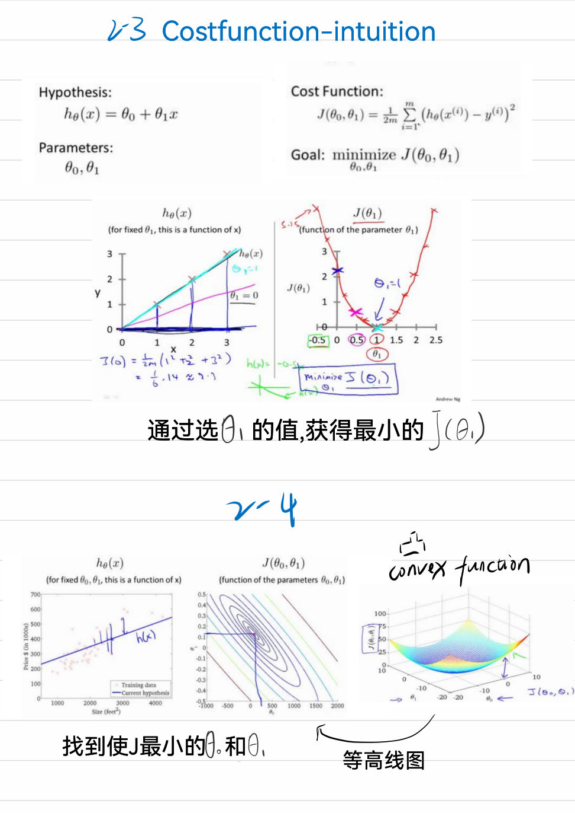
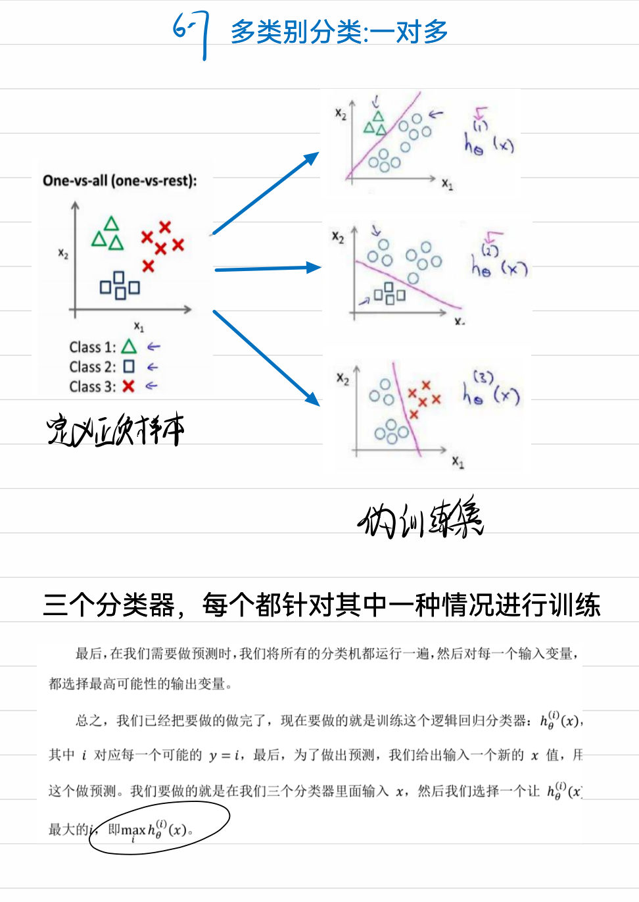
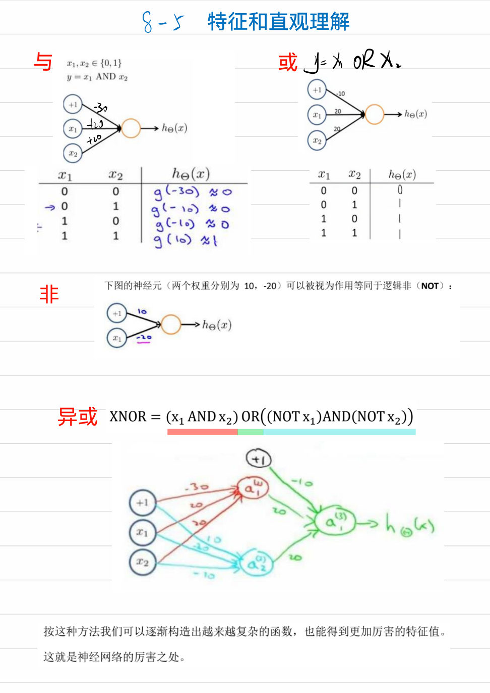
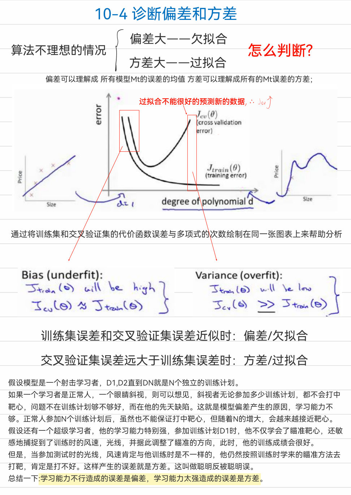
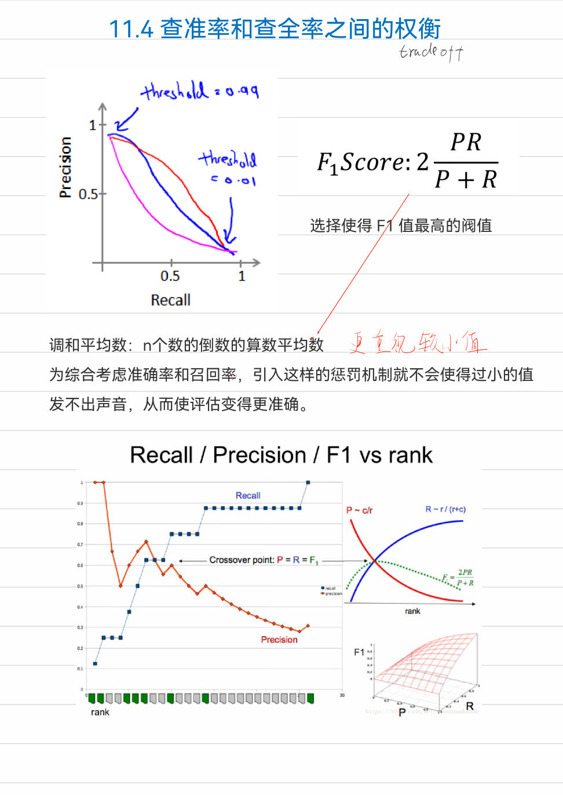
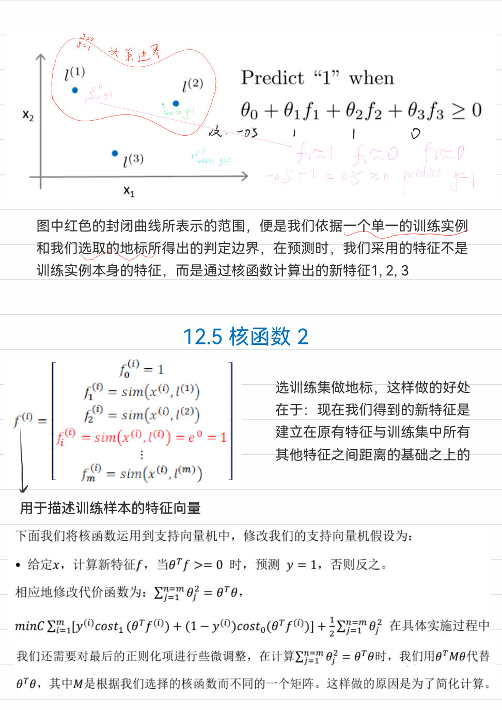
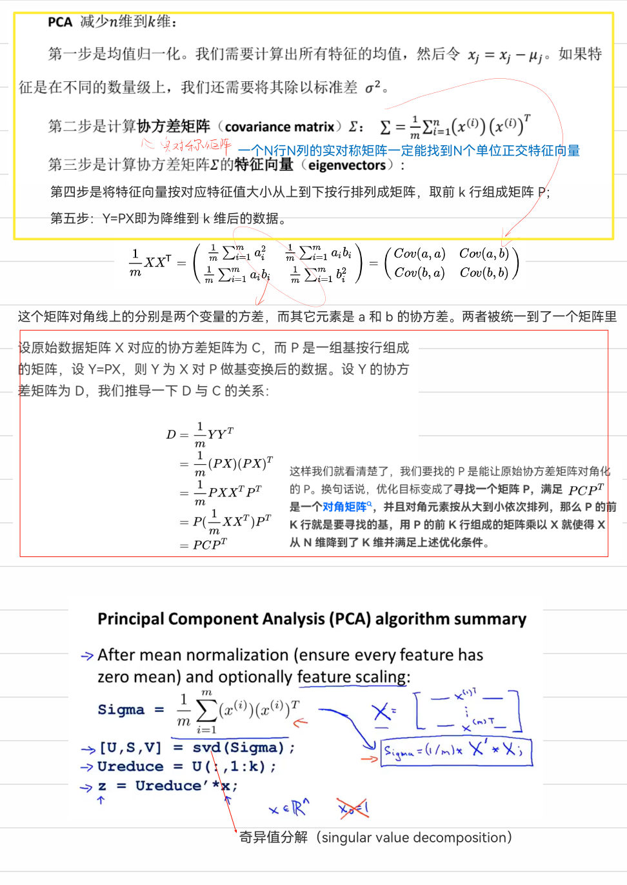
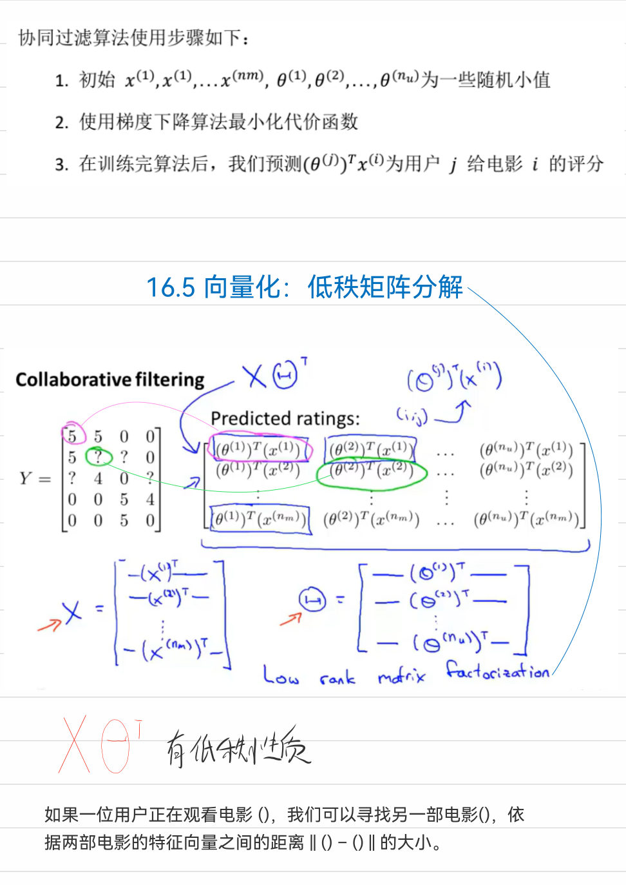
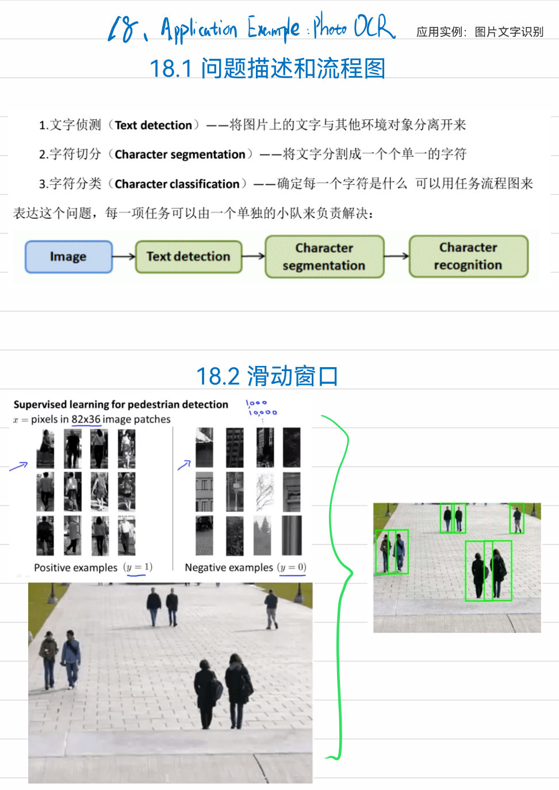

# 机器学习笔记

> 整理自《机器学习笔记-王宇杰.pdf》（90 页）。原稿包含课件截图、手写标注和少量可复制文本；本版按原目录重新组织，并对公式缺失、识别不清处补充了标准表述。PDF 页码以 `p.` 标注，方便回看原稿。

## 阅读导航

- **基础建模**：1～4 章
- **分类、正则化与神经网络**：6～9 章（原目录没有第 5 章）
- **模型诊断与系统设计**：10～11 章
- **经典算法**：12～16 章
- **大规模学习与工程案例**：17～19 章
- **数学速查**：文末附录

## 记号约定

| 记号 | 含义 |
|---|---|
| $m$ | 训练样本数 |
| $n$ | 特征数 |
| $x^{(i)}$ | 第 $i$ 个样本，通常令 $x_0^{(i)}=1$ |
| $y^{(i)}$ | 第 $i$ 个标签 |
| $\theta$ | 模型参数 |
| $h_\theta(x)$ | 假设函数/预测函数 |
| $J(\theta)$ | 代价函数 |
| $\alpha$ | 学习率 |
| $\lambda$ | 正则化强度 |

---

## 1. 引言（p.3–4）

Tom Mitchell 的定义：若程序在任务 $T$ 上的表现（用指标 $P$ 衡量）随经验 $E$ 增加而提高，则称程序从经验中学习。

### 1.1 监督学习

训练数据包含输入 $x$ 和标签 $y$。

- **回归**：预测连续值，如房价。
- **分类**：预测离散类别，如肿瘤良性/恶性。

### 1.2 无监督学习

训练数据没有标签，算法寻找潜在结构。

- **聚类**：把相似样本分组，如新闻主题聚合。
- **信号分离**：从混合信号中恢复独立源（原稿称“鸡尾酒会问题”）。

---

## 2. 单变量线性回归（p.5–10）

### 2.1 模型与代价函数

单特征线性模型：

$$
h_\theta(x)=\theta_0+\theta_1x
$$

平方误差代价：

$$
J(\theta_0,\theta_1)=\frac{1}{2m}\sum_{i=1}^{m}\left(h_\theta(x^{(i)})-y^{(i)}\right)^2
$$

系数 $1/2$ 使求导后的常数消掉，不影响最优解。等高线图上越靠近中心，$J$ 越小。

### 2.2 梯度下降

同步更新所有参数：

$$
\theta_j \leftarrow \theta_j-\alpha\frac{\partial J(\theta)}{\partial\theta_j},\quad j=0,1
$$

在线性回归中：

$$
\frac{\partial J}{\partial\theta_j}=\frac{1}{m}\sum_{i=1}^{m}
\left(h_\theta(x^{(i)})-y^{(i)}\right)x_j^{(i)}
$$

“批量”梯度下降指每次参数更新都使用全部 $m$ 个样本。线性回归的平方误差是凸函数，因此不存在需要逃离的局部极小值。

**检查要点**：

1. 更新必须基于同一轮旧参数，不能先更新 $\theta_0$ 再用新值计算 $\theta_1$。
2. $\alpha$ 太小收敛慢，太大可能震荡或发散。
3. 迭代时观察 $J(\theta)$ 是否持续下降。

---

## 3. 线性代数回顾（p.11）

- 向量可看作 $n\times1$ 矩阵；矩阵 $A\in\mathbb R^{m\times n}$。
- 只有相同形状的矩阵才能逐元素加减。
- 若 $A\in\mathbb R^{m\times n}$、$B\in\mathbb R^{n\times p}$，则 $AB\in\mathbb R^{m\times p}$。
- 矩阵乘法一般不满足交换律：$AB\ne BA$；满足结合律：$(AB)C=A(BC)$。
- $(AB)^T=B^TA^T$。
- 方阵 $A$ 可逆时 $A^{-1}A=I$；奇异矩阵没有逆。实践中优先使用线性方程求解器，不显式计算逆矩阵。

---

## 4. 多变量线性回归（p.12–16）

### 4.1 向量化模型

$$
h_\theta(x)=\theta^Tx
$$

矩阵形式：$X\in\mathbb R^{m\times(n+1)}$，预测为 $X\theta$。

### 4.2 特征缩放与学习率

不同特征尺度相差很大时，代价函数等高线狭长，梯度下降会来回摆动。常用标准化：

$$
x_j\leftarrow\frac{x_j-\mu_j}{s_j}
$$

$s_j$ 可取标准差或范围。原稿建议按数量级尝试学习率，如 $0.01,0.03,0.1,0.3,1$，并用学习曲线判断。

### 4.3 多项式特征

通过 $x,x^2,x^3$ 或交叉项构造非线性边界。新增高次项后尤其需要特征缩放，也要警惕过拟合。

### 4.4 正规方程

$$
\theta=(X^TX)^{-1}X^Ty
$$

它不需要选择学习率，但计算和存储成本随特征数快速增加。$X^TX$ 不可逆通常来自冗余特征或特征数大于样本数；可删除线性相关特征，或使用伪逆/正则化求解。

---

## 6. 逻辑回归（p.17–21）

> 原 PDF 目录从第 4 章直接跳到第 6 章，本版保留原编号。

### 6.1 假设函数与概率解释

$$
h_\theta(x)=\sigma(\theta^Tx),\qquad
\sigma(z)=\frac{1}{1+e^{-z}}
$$

$h_\theta(x)$ 可解释为 $P(y=1\mid x;\theta)$。阈值为 0.5 时，$\theta^Tx\ge0$ 判为正类，$\theta^Tx=0$ 是决策边界。

### 6.2 交叉熵代价

单样本损失：

$$
\operatorname{Cost}(h,y)=-y\log h-(1-y)\log(1-h)
$$

总体代价：

$$
J(\theta)=-\frac1m\sum_{i=1}^m\left[y^{(i)}\log h_\theta(x^{(i)})+(1-y^{(i)})\log(1-h_\theta(x^{(i)}))\right]
$$

梯度形式与线性回归相似，但 $h_\theta$ 已换成 sigmoid。该目标是凸函数。

### 6.3 高级优化与多分类

共轭梯度、BFGS、L-BFGS 等算法通常比手写梯度下降更快，也更少需要人工选学习率。多分类可用 **one-vs-rest**：每个类别训练一个二分类器，预测时选概率最高的类别。

---

## 7. 正则化（p.22–24）

过拟合表现为训练误差很低、对新数据泛化差。L2 正则化线性回归：

$$
J(\theta)=\frac{1}{2m}\sum_i(h_\theta(x^{(i)})-y^{(i)})^2+
\frac{\lambda}{2m}\sum_{j=1}^{n}\theta_j^2
$$

通常不惩罚偏置 $\theta_0$。对 $j\ge1$ 的更新可写为：

$$
\theta_j\leftarrow\theta_j\left(1-\alpha\frac{\lambda}{m}\right)
-\alpha\frac1m\sum_i(h_\theta(x^{(i)})-y^{(i)})x_j^{(i)}
$$

- $\lambda$ 太小：高方差、易过拟合。
- $\lambda$ 太大：参数被压得过小，高偏差、欠拟合。
- 用验证集选择 $\lambda$，不要用测试集调参。

逻辑回归同样在交叉熵后加入参数平方和。

---

## 8. 神经网络：表示（p.26–30）

当输入维度高、需要复杂非线性特征组合时，显式构造所有多项式项会迅速膨胀。神经网络让隐藏层自行学习中间表示。

第 $l$ 层：

$$
z^{[l]}=\Theta^{[l-1]}a^{[l-1]},\qquad a^{[l]}=g(z^{[l]})
$$

其中 $a^{[1]}=x$；偏置可并入激活向量。由输入层向输出层计算称为前向传播。

### 逻辑门直观理解

通过不同权重和偏置，单元可以模拟 AND、OR、NOT；组合隐藏单元可表示 XOR。这说明多层网络能逐层组合简单特征，形成复杂决策边界。

多分类输出通常采用 one-hot 标签和 softmax，使输出维度等于类别数。

---

## 9. 神经网络的学习（p.31–39）

### 9.1 代价函数

多分类交叉熵配合 L2 正则化：

$$
J(\Theta)=-\frac1m\sum_{i=1}^m\sum_{k=1}^K
\left[y_k^{(i)}\log h_k^{(i)}+(1-y_k^{(i)})\log(1-h_k^{(i)})\right]
+\frac{\lambda}{2m}\sum_l\sum_{r,c}(\Theta_{r,c}^{[l]})^2
$$

偏置列通常不正则化。

### 9.2 反向传播

1. 前向传播并缓存 $z^{[l]},a^{[l]}$。
2. 输出层误差：$\delta^{[L]}=a^{[L]}-y$。
3. 向前一层传播：

$$
\delta^{[l]}=(\Theta^{[l]})^T\delta^{[l+1]}\odot g'(z^{[l]})
$$

4. 累积梯度并除以 $m$；非偏置参数加入正则化项。

反向传播本质是链式法则的动态规划：复用中间结果，避免重复求导。

### 9.3 梯度检验

数值近似：

$$
\frac{\partial J}{\partial\theta_j}\approx
\frac{J(\theta+\varepsilon e_j)-J(\theta-\varepsilon e_j)}{2\varepsilon}
$$

比较数值梯度与反向传播梯度的相对误差。梯度检验计算昂贵，只在调试时使用，通过后关闭。

### 9.4 随机初始化

所有权重初始化为 0 会导致同层神经元对称、学到相同特征。应使用小随机数或 Xavier/He 初始化；偏置可初始化为 0。

---

## 10. 应用机器学习的建议（p.40–47）

### 10.1 数据集划分

- 训练集：拟合参数。
- 验证集：选择模型、特征、阈值和超参数。
- 测试集：最后一次给出无偏泛化估计。

### 10.2 偏差与方差

| 现象 | 训练误差 | 验证误差 | 常见对策 |
|---|---:|---:|---|
| 高偏差/欠拟合 | 高 | 高且接近训练误差 | 增加特征或模型容量、减小 $\lambda$ |
| 高方差/过拟合 | 低 | 明显更高 | 增加数据、减少特征/容量、增大 $\lambda$ |

### 10.3 学习曲线

绘制误差随训练样本数增长的曲线：

- 高偏差时两条曲线在较高误差处接近，继续加数据帮助有限。
- 高方差时两条曲线存在间隙，增加数据往往有效。

### 10.4 决策顺序

先用诊断确定问题，再行动。不要默认“多收集数据”一定有效。

1. 高方差：更多样本、减小模型、增大正则化。
2. 高偏差：更多/更好的特征、增大模型、减小正则化。
3. 同时检查数据泄漏、标签质量和训练/验证分布是否一致。

---

## 11. 机器学习系统设计（p.48–52）

### 11.1 误差分析

建立快速基线后，人工检查一批错误样本并分类计数。优先修复覆盖错误最多、成本合理的类别。对于垃圾邮件示例，可比较正文特征、路由特征、词干化和拼写变体，而不是凭直觉投入数周开发。

### 11.2 类别不平衡

准确率在偏斜数据上可能误导。定义：

$$
\text{Precision}=\frac{TP}{TP+FP},\qquad
\text{Recall}=\frac{TP}{TP+FN}
$$

$$
F_1=2\frac{\text{Precision}\cdot\text{Recall}}
{\text{Precision}+\text{Recall}}
$$

调高分类阈值通常提高 Precision、降低 Recall；调低阈值反之。阈值应在验证集上按业务代价选择。目标检测中 AP 衡量单类性能，mAP 是多个类别 AP 的平均。

### 11.3 数据规模

大量数据能带来优势需要两个条件：输入包含足够信息，模型容量足够大。还要保证数据覆盖部署分布，而不是仅追求数量。

---

## 12. 支持向量机（p.53–59）

SVM 直接学习分类边界，核心是最大化分类间隔。软间隔目标可写成：

$$
\min_{w,b,\xi}\ \frac12\lVert w\rVert^2+C\sum_i\xi_i
$$

其中 $C$ 控制违反间隔的惩罚：

- $C$ 大：更重视训练误差，可能高方差。
- $C$ 小：允许更多误分，边界更平滑，可能高偏差。

高斯核（RBF）：

$$
K(x,l)=\exp\left(-\frac{\lVert x-l\rVert^2}{2\sigma^2}\right)
$$

$\sigma$ 小会形成更曲折的局部边界；$\sigma$ 大会形成更平滑的边界。使用成熟库时仍需做特征缩放，并通过验证集选择 $C$ 与核参数。

---

## 13. 聚类（p.61–64）

### K-means

重复两步直至收敛：

1. **分配**：$c^{(i)}=\arg\min_k\lVert x^{(i)}-\mu_k\rVert^2$。
2. **更新**：$\mu_k$ 取属于第 $k$ 簇样本的均值。

目标函数：

$$
J(c,\mu)=\frac1m\sum_i\lVert x^{(i)}-\mu_{c^{(i)}}\rVert^2
$$

K-means 对初始化敏感。随机选择训练样本作为初始中心，多次运行后保留 $J$ 最小的结果。簇数可结合肘部法、下游指标和业务可解释性选择；不要只看图形“像不像”。

---

## 14. 降维与 PCA（p.65–72）

PCA 寻找一组正交方向，使投影后的方差最大，等价于最小化投影重建误差。

### 算法

1. 对每个特征做均值归一化，尺度差异明显时再除以标准差。
2. 计算协方差矩阵 $\Sigma=\frac1mX^TX$。
3. 对 $\Sigma$ 做 SVD/特征分解。
4. 取前 $k$ 个主方向组成 $U_k$。
5. 降维：$Z=XU_k$；近似重建：$X_{approx}=ZU_k^T$。

选择最小的 $k$，使保留方差比例达到目标（如 99%）：

$$
\frac{\sum_{j=1}^{k}s_j}{\sum_{j=1}^{n}s_j}\ge0.99
$$

**边界**：PCA 是无监督变换，不知道哪些信息对标签重要，不能把它当作正则化的默认替代。只有在可视化、压缩或计算/存储确有压力时使用，并在训练集上拟合变换。

---

## 15. 异常检测（p.73–77）

对每个特征用高斯分布建模：

$$
p(x)=\prod_{j=1}^{n}\frac{1}{\sqrt{2\pi}\sigma_j}
\exp\left(-\frac{(x_j-\mu_j)^2}{2\sigma_j^2}\right)
$$

若 $p(x)<\varepsilon$，判为异常。$\varepsilon$ 在包含异常样本的验证集上按 $F_1$ 等指标选择。

适合异常检测的情形：异常种类多且不断变化，正常样本多而异常标签少。若正负类都有足够且稳定的标注，监督分类通常更合适。

特征分布严重偏斜时，可做 $\log(x+c)$、平方根等变换，使其更接近高斯。多元高斯能显式建模特征相关性，但协方差矩阵估计需要更多样本且计算更贵。

---

## 16. 推荐系统（p.78–82）

令用户向量为 $\theta^{(j)}$、物品向量为 $x^{(i)}$，评分预测：

$$
\hat y^{(i,j)}=(\theta^{(j)})^Tx^{(i)}
$$

- **基于内容**：物品特征已知，学习用户偏好参数。
- **协同过滤**：用户偏好和物品特征共同从评分矩阵中学习。

正则化目标只在已观察评分上求和。矩阵形式 $X\Theta^T$ 是低秩矩阵分解，可用于预测缺失评分；物品向量距离还能用于寻找相似物品。

均值归一化能处理“从未评分”的用户：先减去每件物品的平均分训练，预测后再加回均值。现代系统还需考虑隐式反馈、冷启动、曝光偏差、多样性与在线实验。

---

## 17. 大规模机器学习（p.83–86）

| 方法 | 每次更新使用的数据 | 特点 |
|---|---|---|
| Batch GD | 全部样本 | 稳定但单步昂贵 |
| SGD | 1 个样本 | 更新快、噪声大 |
| Mini-batch GD | 一小批样本 | 可向量化，是常用折中 |

训练前应打乱数据。监控一段窗口内的平均损失，而不是单个样本损失。学习率可随训练衰减，使参数从“在最小值附近震荡”逐渐转为收敛。

**在线学习**适合数据持续到来、用户偏好会变化的场景；需要同时监控概念漂移和异常输入。MapReduce/数据并行把可加和的梯度计算拆到多台机器，再聚合更新。

---

## 18. 应用实例：图片文字识别（p.87–89）

典型流水线：

1. 文本区域检测。
2. 字符/单词切分（现代 OCR 常直接做序列识别）。
3. 字符识别。
4. 语言模型与后处理。

滑动窗口可把固定尺寸分类器应用到整幅图像；卷积实现能够共享重叠区域计算。数据不足时可用不同字体、背景、透视、旋转、模糊等合成数据，但增强应模拟真实分布。

**上限分析（ceiling analysis）**：依次假设某个流水线模块达到完美，测量整体指标能提升多少；优先优化潜在收益最大的模块。

---

## 19. 总结（p.90）

一套可靠的机器学习流程：

1. 明确任务、数据分布和指标。
2. 建立简单可运行的基线。
3. 划分训练/验证/测试集，防止泄漏。
4. 用向量化和数值检查保证实现正确。
5. 用偏差/方差、学习曲线和误差分析定位瓶颈。
6. 只对已确认的瓶颈增加数据、特征或模型复杂度。
7. 在独立测试集上一次性评估，并监控部署后的漂移。

---

## 附录 A：线性代数速查

- 点积：$a^Tb=\sum_i a_ib_i$，也可理解为长度与夹角的组合。
- 范数：$\lVert x\rVert_2=\sqrt{\sum_i x_i^2}$。
- 正交：$a^Tb=0$；正交矩阵满足 $Q^TQ=I$。
- 特征分解：$Av=\lambda v$；实对称矩阵具有正交特征向量。
- SVD：$A=U\Sigma V^T$，可用于低秩近似、PCA 和稳定求解。

## 附录 B：概率速查

- 条件概率：$P(A\mid B)=P(A\cap B)/P(B)$。
- 贝叶斯公式：$P(A\mid B)=P(B\mid A)P(A)/P(B)$。
- 期望：$E[X]=\sum_xxP(X=x)$ 或 $\int xp(x)dx$。
- 方差：$\operatorname{Var}(X)=E[(X-E[X])^2]$。
- 协方差：$\operatorname{Cov}(X,Y)=E[(X-E[X])(Y-E[Y])]$。
- 最大似然：选择参数使观测数据概率最大；常转为最大化对数似然。

## 复习清单

- [ ] 能从任务类型判断回归、分类、聚类或异常检测。
- [ ] 能写出线性回归、逻辑回归、正则化与梯度下降公式。
- [ ] 能解释前向传播、反向传播和梯度检验。
- [ ] 能用训练/验证误差区分高偏差与高方差。
- [ ] 能正确选择 Precision、Recall、F1、AP/mAP 等指标。
- [ ] 能说明 SVM 的 $C$、RBF 的 $\sigma$、K-means 的 $K$ 和 PCA 的 $k$ 如何选择。
- [ ] 能描述推荐系统、SGD 与 OCR 流水线的基本工程思路。
